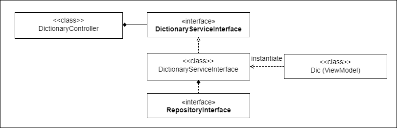

# ViewModel explained in Laravel 5.4
I often encounter a situation where I need to retrieve data from more than one table in database, and the data has to be displayed in view. This usually ends up messy code in controller class. The solution is to implement ViewModel which is a class to maintain data which is displayed in a specific view. This allows you to alleviate any logic in view and reuse same ViewModel in any other view if the data is required. 

# Example

In my own project in Laravel, I create dictionary management pages which allow users to manage their own dictionary (e.g., creating new dictionary, registering words to the dictionary, and listing words that the dictionary contains).

If a user want to list all words of a particular dictionary, I need to retrieve the dictinary data and its related data (e.g., words that the dictionary contains) from more than one table such as Dictionary and Word. In DictinaryService class, it instantiates ViewModel called Dic class after retrieving data from database, and then it returns the ViewModel to DictionaryController. See below:     



### DictionaryController class
```
    public function show($id)
    {
        $dictionaryWords = $this->service->findDictionaryWithItsWords($id);
        return view('dictionaries.show', ['dictionaryWords' => $dictionaryWords->toJson()]);
    }
```
### DictionaryService class
```
    public function findDictionaryWithItsWords(int $id)
    {
        // find dictionary with eager loading by its id
        $dic = $this->dicRepo->findDictionaryWithItsWords($id);
        // create View Model for show page
        $viewModel = Dic::createWith($dic);

        return $viewModel;
    }

```
### Dic class (ViewModel)
```
    class Dic implements JsonSerializable, Jsonable, Arrayable
    {
      /**
       * dictionary id (App\Model\Dictionary)
       * @column id
       */
      protected $dicId;

      /**
       * dictionary name (App\Model\Dictionary)
       * @column name
       */
      protected $dicName;

      /**
       * user id (App\User)
       * @column id
       */
      protected $userId;

      /**
       * words array (App\Model\Word)
       * @column n/a
       */
      protected $words;

      public function __construct(array $attrs = null)
      {
        $this->words = collect([]);

        if (!is_null($attrs)) {
          $props = get_object_vars($this);
          foreach ($props as $propKey => $propVal) {
            $this->$propKey = $attrs[$propKey];
          }
        }
      }

      public static function createWith(Dictionary $dic)
      {
        $instance = new self();
        $instance->assignProps($dic);
        return $instance;
      }

      // getter and setter methods
      ...
      // serialize methods
      ...
  }
```


# Source Code
the related source code is [here](./src)

# References
* [Advantages of ViewModel in MVC (Model View Controller)](https://www.codeproject.com/Articles/826417/Advantages-of-ViewModel-in-MVC-Model-View-Controll)
* [Part 3: Views and ViewModels | Microsoft Docs](https://docs.microsoft.com/en-us/aspnet/mvc/overview/older-versions/mvc-music-store/mvc-music-store-part-3)
